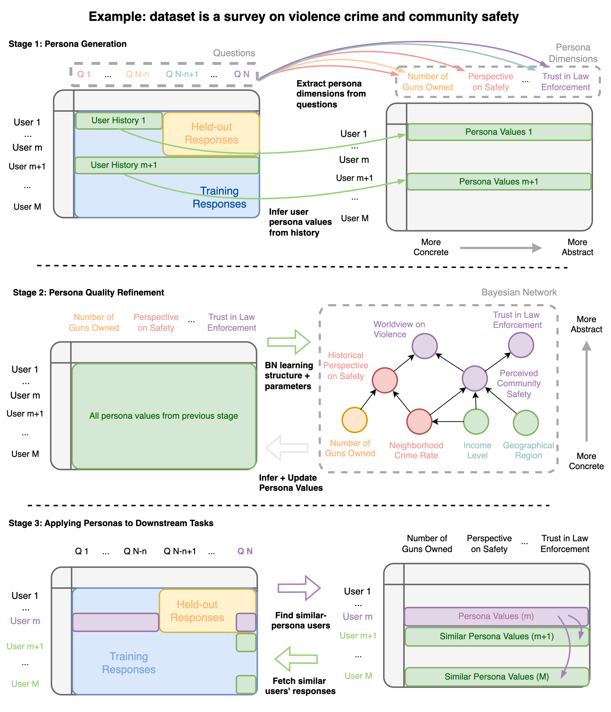

# LUPoM: User Response Prediction with LLM-based User Persona Modeling

This is the code repository for Jialiang's summer 2024 internship project, *User Response Prediction with LLM-based User Persona Modeling*. Please refer to the [final presentation slides](https://drive.corp.amazon.com/documents/liamjxu@/Internship%202024/Jialiang_final_2024_v4.pdf) and [final writeup]() of the project for the technical details.

Leadership contact: Rishi Rajasekaran, Chetan Nagaraj Naik.  

## 🏗️ Pipeline Architecture



## 📦 Setting up environment

To set up the environment, first make sure `conda` is installed and in path. Then simply run 

```bash
conda create -n lupom python=3.10 -y
conda activate lupom
sh experiment/scripts/setup.sh
```

This should create a new conda environment, download dependencies, and make experiment folders.

## 📊 Dataset

The datase used in this project is the OpinionsQA dataset. The dataset has been uploaded to the S3 bucket at `s3://probabilistic-user-modeling/`. In addition, we directly interface with the S3 bucket in this project's code, so no additional downloading/processing is needed.

## 1️⃣ Stage 1. Persona Generation

In stage 1, we have two steps: generating persona dimensions and inferring user personas.

### 1.1 Generating persona dimenisons

In this project, we generate user personas for the surveys used in the original [Persona-DB paper](https://arxiv.org/abs/2402.11060). To generate user persona dimensions, simply run

```bash
sh experiment/scripts/generate_persona_dim/run_generate_personas_haiku_kmeans10_desc_personadb.sh
```

At the end of this step, a directory with path `lupom/opinions_qa/persona_dim/date0920_haiku_kmeans10_single_example_known_test_use_all_q` should be generated. Other configurations can also be easily run by modifying parameters in the bash script. 

### 1.2 Inferring Persona Values
Once we have the persona dimensions determined, we can proceed to infer persona values by prompting the LLMs. Assuming we used the default parameters from above, simply run

```bash
sh experiment/scripts/infer_persona_val/run_predict_persona_infer_full_haiku_personadb.sh 34
# sh experiment/scripts/infer_persona_val/run_predict_persona_infer_full_haiku_personadb.sh 41
# sh experiment/scripts/infer_persona_val/run_predict_persona_infer_full_haiku_personadb.sh 82
```

The survey indices used in the Persona-DB paper are 34, 41 and 82. 

By the end of this step, we should be able to see the inferred user persona values at `opinions_qa/persona_val`, for example when we generate for survey 34, we will see `opinions_qa/persona_val/American_Trends_Panel_W34/date0920_personas_full_personadb.json`

## 2️⃣ Stage 2. Persona Quality Refinement

In this stage, we fit Bayesian Networks on the user persona values inferred from above, and then use the Bayesian Network to refine the persona quality, by updating the values with Bayesian Inferencing. 

```bash
sh experiment/scripts/bn_update_persona/run_bn_update_persona.sh 34 bds
# sh experiment/scripts/bn_update_persona/run_bn_update_persona.sh 34 bdeu
# sh experiment/scripts/bn_update_persona/run_bn_update_persona.sh 34 bic
```

Here, we can choose three differnet scoring fuctions to use in the Bayesian Network construction process: `bds`, `bdeu`, and `bic`. We refer interested readers to [https://proceedings.mlr.press/v73/scutari17a/scutari17a.pdf](https://proceedings.mlr.press/v73/scutari17a/scutari17a.pdf) for details regarding these scoring functions.

By the end of this step, we should see the updated user persona values at `opinions_qa/persona_val/`, e.g., `opinions_qa/persona_val/American_Trends_Panel_W34/date0920_personas_full_personadb_bn_hcbds.json`

## 3️⃣ Stage 3. Applying Personas to Downstream Tasks

### 3.1 Fetching similar users
Once we had the persona values, we can now use them in the downstream tasks. But before we run actual response prediction, we have one more task to do: fetching similar-persona users. This can be done by simply running

```bash
sh experiment/scripts/get_similar_users/get_similar_users.sh 34
sh experiment/scripts/get_similar_users/get_similar_users_bn.sh 34

# sh experiment/scripts/get_similar_users/get_similar_users.sh 41
# sh experiment/scripts/get_similar_users/get_similar_users_bn.sh 41

# sh experiment/scripts/get_similar_users/get_similar_users.sh 82
# sh experiment/scripts/get_similar_users/get_similar_users_bn.sh 82
```

The hyperparameters used in the scripts are obatained via grid search in our experiments.

By the end of this step, we should see similar-persona user mapping under the path `opinions_qa/similar_users`.

### 3.2 RAG and all other configurations

Once we have the similar-persona user mapping, we can perform actual response prediction. 

For ablation study, run

```bash
sh experiment/scripts/predict_response/run_predict_personadb_allpred_allconfig.sh 34 haiku
```

For RAG without BN, run
```bash
sh experiment/scripts/predict_response/run_predict_all_haiku_personadb_rag.sh 34
```


For switching predictor backbone, run

```bash
sh experiment/scripts/predict_response/run_predict_personadb_allpred_allconfig.sh 34 haiku
sh experiment/scripts/predict_response/run_predict_personadb_allpred_allconfig.sh 34 sonnet
sh experiment/scripts/predict_response/run_predict_personadb_allpred_allconfig.sh 34 mistrallarge
sh experiment/scripts/predict_response/run_predict_personadb_allpred_allconfig.sh 34 llama70b3
```

## 🔍 Evaluation

For easier evaluation visualization, we put the code for calculating the evaluation metrics, as well as displaying them in a readable format, in the Jupyter Notebook `lupom/experiment/eval_personadb_surveys.ipynb`. 

To get the evaluation results, simply open the notebook and run all cells.